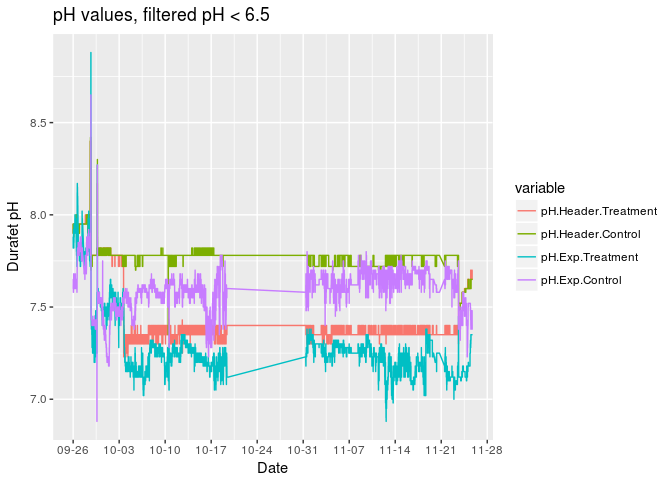
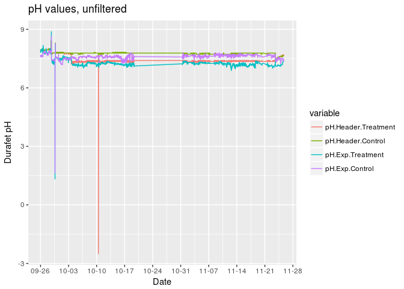
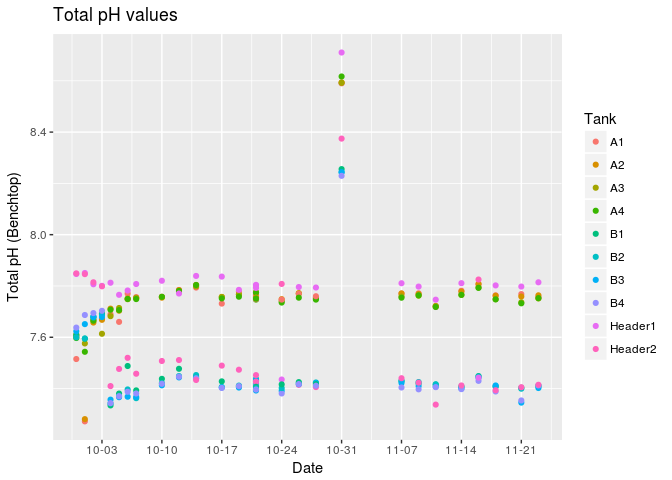
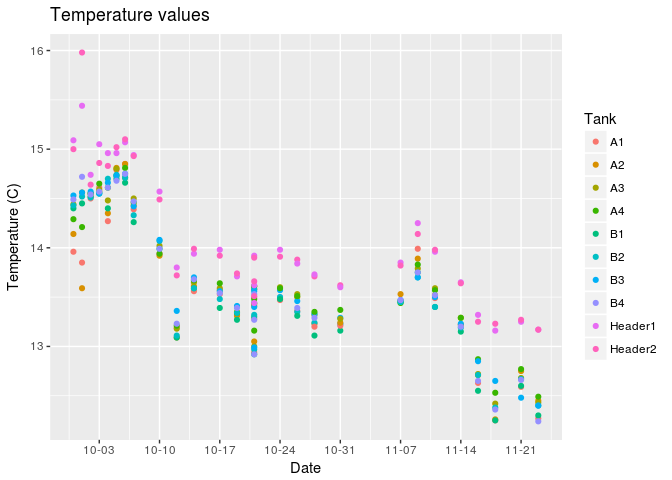
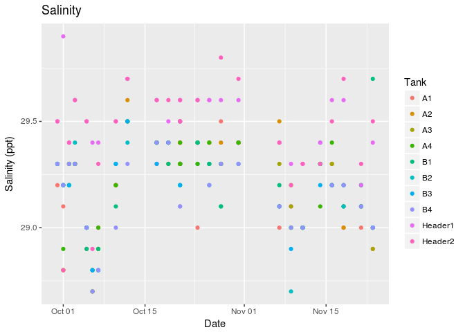

This is an [R Markdown](http://rmarkdown.rstudio.com) Notebook. When you
execute code within the notebook, the results appear beneath the code.

    library(dplyr)

    ## 
    ## Attaching package: 'dplyr'

    ## The following objects are masked from 'package:stats':
    ## 
    ##     filter, lag

    ## The following objects are masked from 'package:base':
    ## 
    ##     intersect, setdiff, setequal, union

    library(ggplot2)
    library(reshape2)
    library(readr) #combine .csv files
    library(lubridate)

    ## 
    ## Attaching package: 'lubridate'

    ## The following object is masked from 'package:base':
    ## 
    ##     date

Reading in daa from avtech system, which measured the Durafets in the
Header and Experiment tanks (as well as a lot of other irrelevant
sensors). Filtering out only the columns for Header and Control Durafets
and changing their names. NOTE: I think Control and Treatment were
switched in the actual experiment relative to their labeling in the
avtech system, so I have switched them here. Will double check.

    avtech <- read.csv("../Data/WaterChem/Scallop-OA-Project-master/Data/avtech/avtech_20160926-20161125.csv", header = TRUE)
    colnames(avtech)[grep("Temp",colnames(avtech), value = FALSE)]

    ##  [1] "Internal.Sensor...Temperature..C."
    ##  [2] "pH.1.Q...Temperature..C."         
    ##  [3] "pH.2.Q...Temperature..C."         
    ##  [4] "Salinity.3...Temperature..C."     
    ##  [5] "Salinity.4...Temperature..C."     
    ##  [6] "Tank.3...Temperature..C."         
    ##  [7] "Tank.6...Temperature..C."         
    ##  [8] "pH.Exp.Treat....Temperature..C."  
    ##  [9] "pH.Exp.Cont....Temperature..C."   
    ## [10] "Q.Tank.1...Temperature..C."       
    ## [11] "Treatment.A...Temperature..C."    
    ## [12] "Treatment.B...Temperature..C."    
    ## [13] "Header.Tanks...Temperature..C."   
    ## [14] "Header.1...Temperature..C."       
    ## [15] "Header.2...Temperature..C."       
    ## [16] "Q.Tank.2...Temperature..C."       
    ## [17] "Control.A...Temperature..C."      
    ## [18] "Control.B...Temperature..C."      
    ## [19] "WiSH.Ceiling...Temperature..C."   
    ## [20] "Tank.5...Temperature..C."         
    ## [21] "Tank.2...Temperature..C."         
    ## [22] "WiSH.Sensor.5...Temperature..C."  
    ## [23] "WiSH.5.Ext..1...Temperature..C."  
    ## [24] "WiSH.Sensor.2...Temperature..C."  
    ## [25] "WiSH.2.Ext..1...Temperature..C."  
    ## [26] "WiSH.2.Ext..2...Temperature..C."  
    ## [27] "WiSH.Sensor.3...Temperature..C."  
    ## [28] "WiSH.3.Ext..1...Temperature..C."  
    ## [29] "WiSH.3.Ext..2...Temperature..C."

    avtech <- select(avtech, Date...Time, pH.Header.Cont....Custom.Value, pH.Header.Treat...Custom.Value, pH.Exp.Cont....Custom.Value, pH.Exp.Treat....Custom.Value)
    colnames(avtech) <- c("Date","pH.Header.Treatment","pH.Header.Control","pH.Exp.Treatment","pH.Exp.Control")

Graphing avtech data, both raw and filtering out pH &lt; 6.5:

    melted <- melt(avtech, id="Date")
    melted$Date <- mdy_hms(melted$Date)
    melted.filt <- filter(melted, value > 6.5)
    ggplot(melted.filt,aes(x=Date, y=value, colour = variable)) + geom_line() + xlab("Date") +ylab("Durafet pH") + ggtitle("pH values, filtered pH < 6.5") +scale_x_datetime(date_breaks = "1 week",date_labels = "%m-%d")

    ggplot(melted,aes(x=Date, y=value, colour = variable)) + geom_line() + xlab("Date") +ylab("Durafet pH") + ggtitle("pH values, unfiltered") +scale_x_datetime(date_breaks = "1 week",date_labels = "%m-%d",)

Merge multiple .csv files into 1 master file and save

    csv.path <- ("/home/ksilliman/Projects/OA_Ostrea/Data/WaterChem/Scallop-OA-Project-master/Data/SW.chem.dps")
    SW.ag <- list.files(path = csv.path, full.names = TRUE) %>% 
      lapply(read_csv) %>%
      bind_rows

    ## Parsed with column specification:
    ## cols(
    ##   Measure.Date = col_integer(),
    ##   Calib.Date = col_integer(),
    ##   Exposure = col_character(),
    ##   Tank = col_character(),
    ##   Treatment = col_character(),
    ##   Temperature = col_double(),
    ##   pH.MV = col_double(),
    ##   Salinity = col_double(),
    ##   TA = col_character(),
    ##   Notes = col_character()
    ## )
    ## Parsed with column specification:
    ## cols(
    ##   Measure.Date = col_integer(),
    ##   Calib.Date = col_integer(),
    ##   Exposure = col_character(),
    ##   Tank = col_character(),
    ##   Treatment = col_character(),
    ##   Temperature = col_double(),
    ##   pH.MV = col_double(),
    ##   Salinity = col_double(),
    ##   TA = col_character(),
    ##   Notes = col_character()
    ## )
    ## Parsed with column specification:
    ## cols(
    ##   Measure.Date = col_integer(),
    ##   Calib.Date = col_integer(),
    ##   Exposure = col_character(),
    ##   Tank = col_character(),
    ##   Treatment = col_character(),
    ##   Temperature = col_double(),
    ##   pH.MV = col_double(),
    ##   Salinity = col_double(),
    ##   TA = col_character(),
    ##   Notes = col_character()
    ## )
    ## Parsed with column specification:
    ## cols(
    ##   Measure.Date = col_integer(),
    ##   Calib.Date = col_integer(),
    ##   Exposure = col_character(),
    ##   Tank = col_character(),
    ##   Treatment = col_character(),
    ##   Temperature = col_double(),
    ##   pH.MV = col_double(),
    ##   Salinity = col_double(),
    ##   TA = col_character(),
    ##   Notes = col_character()
    ## )

    ## Parsed with column specification:
    ## cols(
    ##   Measure.Date = col_integer(),
    ##   Calib.Date = col_integer(),
    ##   Exposure = col_character(),
    ##   Tank = col_character(),
    ##   Treatment = col_character(),
    ##   Temperature = col_double(),
    ##   pH.MV = col_double(),
    ##   Salinity = col_character(),
    ##   TA = col_character(),
    ##   Notes = col_character()
    ## )

    ## Parsed with column specification:
    ## cols(
    ##   Measure.Date = col_integer(),
    ##   Calib.Date = col_integer(),
    ##   Exposure = col_character(),
    ##   Tank = col_character(),
    ##   Treatment = col_character(),
    ##   Temperature = col_double(),
    ##   pH.MV = col_double(),
    ##   Salinity = col_double(),
    ##   TA = col_character(),
    ##   Notes = col_character()
    ## )
    ## Parsed with column specification:
    ## cols(
    ##   Measure.Date = col_integer(),
    ##   Calib.Date = col_integer(),
    ##   Exposure = col_character(),
    ##   Tank = col_character(),
    ##   Treatment = col_character(),
    ##   Temperature = col_double(),
    ##   pH.MV = col_double(),
    ##   Salinity = col_double(),
    ##   TA = col_character(),
    ##   Notes = col_character()
    ## )
    ## Parsed with column specification:
    ## cols(
    ##   Measure.Date = col_integer(),
    ##   Calib.Date = col_integer(),
    ##   Exposure = col_character(),
    ##   Tank = col_character(),
    ##   Treatment = col_character(),
    ##   Temperature = col_double(),
    ##   pH.MV = col_double(),
    ##   Salinity = col_double(),
    ##   TA = col_character(),
    ##   Notes = col_character()
    ## )
    ## Parsed with column specification:
    ## cols(
    ##   Measure.Date = col_integer(),
    ##   Calib.Date = col_integer(),
    ##   Exposure = col_character(),
    ##   Tank = col_character(),
    ##   Treatment = col_character(),
    ##   Temperature = col_double(),
    ##   pH.MV = col_double(),
    ##   Salinity = col_double(),
    ##   TA = col_character(),
    ##   Notes = col_character()
    ## )
    ## Parsed with column specification:
    ## cols(
    ##   Measure.Date = col_integer(),
    ##   Calib.Date = col_integer(),
    ##   Exposure = col_character(),
    ##   Tank = col_character(),
    ##   Treatment = col_character(),
    ##   Temperature = col_double(),
    ##   pH.MV = col_double(),
    ##   Salinity = col_double(),
    ##   TA = col_character(),
    ##   Notes = col_character()
    ## )

    ## Parsed with column specification:
    ## cols(
    ##   Measure.Date = col_integer(),
    ##   Calib.Date = col_integer(),
    ##   Exposure = col_character(),
    ##   Tank = col_character(),
    ##   Treatment = col_character(),
    ##   Temperature = col_double(),
    ##   pH.MV = col_double(),
    ##   Salinity = col_character(),
    ##   TA = col_character(),
    ##   Notes = col_character()
    ## )

    ## Parsed with column specification:
    ## cols(
    ##   Measure.Date = col_integer(),
    ##   Calib.Date = col_integer(),
    ##   Exposure = col_character(),
    ##   Tank = col_character(),
    ##   Treatment = col_character(),
    ##   Temperature = col_double(),
    ##   pH.MV = col_double(),
    ##   Salinity = col_double(),
    ##   TA = col_character(),
    ##   Notes = col_character()
    ## )
    ## Parsed with column specification:
    ## cols(
    ##   Measure.Date = col_integer(),
    ##   Calib.Date = col_integer(),
    ##   Exposure = col_character(),
    ##   Tank = col_character(),
    ##   Treatment = col_character(),
    ##   Temperature = col_double(),
    ##   pH.MV = col_double(),
    ##   Salinity = col_double(),
    ##   TA = col_character(),
    ##   Notes = col_character()
    ## )
    ## Parsed with column specification:
    ## cols(
    ##   Measure.Date = col_integer(),
    ##   Calib.Date = col_integer(),
    ##   Exposure = col_character(),
    ##   Tank = col_character(),
    ##   Treatment = col_character(),
    ##   Temperature = col_double(),
    ##   pH.MV = col_double(),
    ##   Salinity = col_double(),
    ##   TA = col_character(),
    ##   Notes = col_character()
    ## )
    ## Parsed with column specification:
    ## cols(
    ##   Measure.Date = col_integer(),
    ##   Calib.Date = col_integer(),
    ##   Exposure = col_character(),
    ##   Tank = col_character(),
    ##   Treatment = col_character(),
    ##   Temperature = col_double(),
    ##   pH.MV = col_double(),
    ##   Salinity = col_double(),
    ##   TA = col_character(),
    ##   Notes = col_character()
    ## )
    ## Parsed with column specification:
    ## cols(
    ##   Measure.Date = col_integer(),
    ##   Calib.Date = col_integer(),
    ##   Exposure = col_character(),
    ##   Tank = col_character(),
    ##   Treatment = col_character(),
    ##   Temperature = col_double(),
    ##   pH.MV = col_double(),
    ##   Salinity = col_double(),
    ##   TA = col_character(),
    ##   Notes = col_character()
    ## )
    ## Parsed with column specification:
    ## cols(
    ##   Measure.Date = col_integer(),
    ##   Calib.Date = col_integer(),
    ##   Exposure = col_character(),
    ##   Tank = col_character(),
    ##   Treatment = col_character(),
    ##   Temperature = col_double(),
    ##   pH.MV = col_double(),
    ##   Salinity = col_double(),
    ##   TA = col_character(),
    ##   Notes = col_character()
    ## )
    ## Parsed with column specification:
    ## cols(
    ##   Measure.Date = col_integer(),
    ##   Calib.Date = col_integer(),
    ##   Exposure = col_character(),
    ##   Tank = col_character(),
    ##   Treatment = col_character(),
    ##   Temperature = col_double(),
    ##   pH.MV = col_double(),
    ##   Salinity = col_double(),
    ##   TA = col_character(),
    ##   Notes = col_character()
    ## )
    ## Parsed with column specification:
    ## cols(
    ##   Measure.Date = col_integer(),
    ##   Calib.Date = col_integer(),
    ##   Exposure = col_character(),
    ##   Tank = col_character(),
    ##   Treatment = col_character(),
    ##   Temperature = col_double(),
    ##   pH.MV = col_double(),
    ##   Salinity = col_double(),
    ##   TA = col_character(),
    ##   Notes = col_character()
    ## )
    ## Parsed with column specification:
    ## cols(
    ##   Measure.Date = col_integer(),
    ##   Calib.Date = col_integer(),
    ##   Exposure = col_character(),
    ##   Tank = col_character(),
    ##   Treatment = col_character(),
    ##   Temperature = col_double(),
    ##   pH.MV = col_double(),
    ##   Salinity = col_double(),
    ##   TA = col_character(),
    ##   Notes = col_character()
    ## )
    ## Parsed with column specification:
    ## cols(
    ##   Measure.Date = col_integer(),
    ##   Calib.Date = col_integer(),
    ##   Exposure = col_character(),
    ##   Tank = col_character(),
    ##   Treatment = col_character(),
    ##   Temperature = col_double(),
    ##   pH.MV = col_double(),
    ##   Salinity = col_double(),
    ##   TA = col_character(),
    ##   Notes = col_character()
    ## )
    ## Parsed with column specification:
    ## cols(
    ##   Measure.Date = col_integer(),
    ##   Calib.Date = col_integer(),
    ##   Exposure = col_character(),
    ##   Tank = col_character(),
    ##   Treatment = col_character(),
    ##   Temperature = col_double(),
    ##   pH.MV = col_double(),
    ##   Salinity = col_double(),
    ##   TA = col_character(),
    ##   Notes = col_character()
    ## )
    ## Parsed with column specification:
    ## cols(
    ##   Measure.Date = col_integer(),
    ##   Calib.Date = col_integer(),
    ##   Exposure = col_character(),
    ##   Tank = col_character(),
    ##   Treatment = col_character(),
    ##   Temperature = col_double(),
    ##   pH.MV = col_double(),
    ##   Salinity = col_double(),
    ##   TA = col_character(),
    ##   Notes = col_character()
    ## )
    ## Parsed with column specification:
    ## cols(
    ##   Measure.Date = col_integer(),
    ##   Calib.Date = col_integer(),
    ##   Exposure = col_character(),
    ##   Tank = col_character(),
    ##   Treatment = col_character(),
    ##   Temperature = col_double(),
    ##   pH.MV = col_double(),
    ##   Salinity = col_double(),
    ##   TA = col_character(),
    ##   Notes = col_character()
    ## )
    ## Parsed with column specification:
    ## cols(
    ##   Measure.Date = col_integer(),
    ##   Calib.Date = col_integer(),
    ##   Exposure = col_character(),
    ##   Tank = col_character(),
    ##   Treatment = col_character(),
    ##   Temperature = col_double(),
    ##   pH.MV = col_double(),
    ##   Salinity = col_double(),
    ##   TA = col_character(),
    ##   Notes = col_character()
    ## )
    ## Parsed with column specification:
    ## cols(
    ##   Measure.Date = col_integer(),
    ##   Calib.Date = col_integer(),
    ##   Exposure = col_character(),
    ##   Tank = col_character(),
    ##   Treatment = col_character(),
    ##   Temperature = col_double(),
    ##   pH.MV = col_double(),
    ##   Salinity = col_double(),
    ##   TA = col_character(),
    ##   Notes = col_character()
    ## )
    ## Parsed with column specification:
    ## cols(
    ##   Measure.Date = col_integer(),
    ##   Calib.Date = col_integer(),
    ##   Exposure = col_character(),
    ##   Tank = col_character(),
    ##   Treatment = col_character(),
    ##   Temperature = col_double(),
    ##   pH.MV = col_double(),
    ##   Salinity = col_double(),
    ##   TA = col_character(),
    ##   Notes = col_character()
    ## )
    ## Parsed with column specification:
    ## cols(
    ##   Measure.Date = col_integer(),
    ##   Calib.Date = col_integer(),
    ##   Exposure = col_character(),
    ##   Tank = col_character(),
    ##   Treatment = col_character(),
    ##   Temperature = col_double(),
    ##   pH.MV = col_double(),
    ##   Salinity = col_double(),
    ##   TA = col_character(),
    ##   Notes = col_character()
    ## )

    SW.ag

    ## # A tibble: 280 × 10
    ##    Measure.Date Calib.Date  Exposure    Tank Treatment Temperature pH.MV
    ##           <int>      <int>     <chr>   <chr>     <chr>       <dbl> <dbl>
    ## 1      20160930   20160930 Exposure1      A1   Ambient       13.96 -38.6
    ## 2      20160930   20160930 Exposure1      A2   Ambient       14.14 -43.7
    ## 3      20160930   20160930 Exposure1      A3   Ambient       14.44 -44.2
    ## 4      20160930   20160930 Exposure1      A4   Ambient       14.29 -43.4
    ## 5      20160930   20160930 Exposure1      B1   Ambient       14.40 -44.1
    ## 6      20160930   20160930 Exposure1      B2   Ambient       14.43 -43.6
    ## 7      20160930   20160930 Exposure1      B3   Ambient       14.53 -45.0
    ## 8      20160930   20160930 Exposure1      B4   Ambient       14.49 -45.8
    ## 9      20160930   20160930 Exposure1 Header1   Ambient       15.09 -58.0
    ## 10     20160930   20160930 Exposure1 Header2   Ambient       15.00 -58.1
    ## # ... with 270 more rows, and 3 more variables: Salinity <dbl>, TA <chr>,
    ## #   Notes <chr>

    write.csv(SW.ag,file = "/home/ksilliman/Projects/OA_Ostrea/Data/WaterChem/Scallop-OA-Project-master/Data/SW.chem.ag.csv")

The following code is adapted from [Hollie Putnam's OA Geoduck
experiment](https://github.com/hputnam/project_larval_geoduck_OA):

    #Read in required libraries
    library(seacarb) #seawater carbonate chemistry

    ## Loading required package: oce

    ## Loading required package: gsw

    #library(reshape2) #reshape data
    library(plotrix) #functions in tapply

    ## 
    ## Attaching package: 'plotrix'

    ## The following object is masked from 'package:oce':
    ## 
    ##     rescale

    library(ggplot2) #plotting library
    #library(gridExtra) #provides plotting grid layouts

    #Required Data files

    #####SEAWATER CHEMISTRY ANALYSIS FOR DISCRETE MEASUREMENTS#####

    ##### pH Tris Calibration Curves #####
    #For conversion equations for pH from mV to total scale using tris standard

    path <-("/home/ksilliman/Projects/OA_Ostrea/Data/WaterChem/Scallop-OA-Project-master/Data/TRIScalibs/")

    #list all the file names in the folder to get only get the csv files
    file.names<-list.files(path = path, pattern = "csv$")

    pH.cals <- data.frame(matrix(NA, nrow=length(file.names), ncol=4, dimnames=list(file.names,c("Calib.Date", "Intercept", "Slope","R2")))) #generate a 3 column dataframe with specific column names

    for(i in 1:length(file.names)) { # for every file in list start at the first and run this following function
      Calib.Data <-read.table(file.path(path,file.names[i]), header=TRUE, sep=",", na.string="NA", as.is=TRUE) #reads in the data files
      model <-lm(mVTris ~ TTris, data=Calib.Data) #runs a linear regression of mV as a function of temperature
      coe <- coef(model) #extracts the coeffecients
      R <- summary(model)$r.squared #extracts the R2
      pH.cals[i,2:3] <- coe #inserts coef in the dataframe
      pH.cals[i,4] <- R #inserts R2 in the dataframe
      pH.cals[i,1] <- substr(file.names[i],1,8) #stores the file name in the Date column
    }

    # read in temperature and salinity
    SW.chem <- read.csv("../Data/WaterChem/Scallop-OA-Project-master/Data/SW.chem.ag.csv", header=TRUE, sep=",", na.strings="NA") #load data with a header, separated by commas, with NA as NA

    #merge with Seawater chemistry file
    SW.chem <- merge(pH.cals, SW.chem, by="Calib.Date")

    #constants for use in pH calculation 
    R <- 8.31447215 #gas constant in J mol-1 K-1 
    F <-96485.339924 #Faraday constant in coulombs mol-1

    mvTris <- SW.chem$Temperature*SW.chem$Slope+SW.chem$Intercept #calculate the mV of the tris standard using the temperature mv relationships in the measured standard curves 
    STris<-27.5 #salinity of the Tris
    phTris<- (11911.08-18.2499*STris-0.039336*STris^2)*(1/(SW.chem$Temperature+273.15))-366.27059+ 0.53993607*STris+0.00016329*STris^2+(64.52243-0.084041*STris)*log(SW.chem$Temperature+273.15)-0.11149858*(SW.chem$Temperature+273.15) #calculate the pH of the tris (Dickson A. G., Sabine C. L. and Christian J. R., SOP 6a)
    SW.chem$pH.Total<-phTris+(mvTris/1000-SW.chem$pH.MV/1000)/(R*(SW.chem$Temperature+273.15)*log(10)/F) #calculate the pH on the total scale (Dickson A. G., Sabine C. L. and Christian J. R., SOP 6a)
    colnames(SW.chem)

    ##  [1] "Calib.Date"   "Intercept"    "Slope"        "R2"          
    ##  [5] "X"            "Measure.Date" "Exposure"     "Tank"        
    ##  [9] "Treatment"    "Temperature"  "pH.MV"        "Salinity"    
    ## [13] "TA"           "Notes"        "pH.Total"

Graphing Total pH:

    SW.chem$Measure.Date <- ymd(SW.chem$Measure.Date)
    ggplot(SW.chem,aes(x=Measure.Date, y=pH.Total, colour = Tank)) + geom_point() + xlab("Date") +ylab("Total pH (Benchtop)") + ggtitle("Total pH values") +scale_x_date(date_breaks = "1 week",date_labels = "%m-%d")

10-31-16 has unusual values:

    SW.chem$Measure.Date[which(SW.chem$pH.Total > 8)]

    ##  [1] "2016-10-31" "2016-10-31" "2016-10-31" "2016-10-31" "2016-10-31"
    ##  [6] "2016-10-31" "2016-10-31" "2016-10-31" "2016-10-31" "2016-10-31"

    ggplot(SW.chem,aes(x=Measure.Date, y=Temperature, colour = Tank)) + geom_point() + xlab("Date") +ylab("Temperature (C)") + ggtitle("Temperature values") +scale_x_date(date_breaks = "1 week",date_labels = "%m-%d")

    ggplot(SW.chem,aes(x=Measure.Date, y=Salinity, colour = Tank)) + geom_point() + xlab("Date") +ylab("Salinity (ppt)") + ggtitle("Salinity")

    ## Warning: Removed 20 rows containing missing values (geom_point).

Salinity measurements are missing on 10/14/16 and 10/4/16:

    SW.chem$Measure.Date[which(is.na(SW.chem$Salinity))]

    ##  [1] "2016-10-04" "2016-10-04" "2016-10-04" "2016-10-04" "2016-10-04"
    ##  [6] "2016-10-04" "2016-10-04" "2016-10-04" "2016-10-04" "2016-10-04"
    ## [11] "2016-10-14" "2016-10-14" "2016-10-14" "2016-10-14" "2016-10-14"
    ## [16] "2016-10-14" "2016-10-14" "2016-10-14" "2016-10-14" "2016-10-14"

Calculations for other carbonate parameters. Requires TA values, which
we currently don't have.

    # #### Seacarb Calculations #####
    # 
    # #Calculate CO2 parameters using seacarb
    # carb.output <- carb(flag=8, var1=SW.chem$pH.Total, var2=SW.chem$TA/1000000, S= SW.chem$Salinity, T=SW.chem$Temperature, P=0, Pt=0, Sit=0, pHscale="T", kf="pf", k1k2="l", ks="d") #calculate seawater chemistry parameters using seacarb
    # 
    # carb.output$ALK <- carb.output$ALK*1000000 #convert to µmol kg-1
    # carb.output$CO2 <- carb.output$CO2*1000000 #convert to µmol kg-1
    # carb.output$HCO3 <- carb.output$HCO3*1000000 #convert to µmol kg-1
    # carb.output$CO3 <- carb.output$CO3*1000000 #convert to µmol kg-1
    # carb.output$DIC <- carb.output$DIC*1000000 #convert to µmol kg-1
    # 
    # carb.output <- cbind(SW.chem$Measure.Date,  SW.chem$Tank,  SW.chem$Treatment, carb.output) #combine the sample information with the seacarb output
    # colnames(carb.output) <- c("Date",  "Tank",  "Treatment", "flag", "Salinity", "Temperature",  "Pressure", "pH",   "CO2",  "pCO2", "fCO2", "HCO3", "CO3",  "DIC", "TA",    "Aragonite.Sat",    "Calcite.Sat") #Rename columns to describe contents
    # carb.output <- subset(carb.output, select= c("Date",  "Tank",  "Treatment",   "Salinity", "Temperature",      "pH",   "CO2",  "pCO2", "HCO3", "CO3",  "DIC", "TA",    "Aragonite.Sat"))
    # 
    # ##### Descriptive Statistics #####
    # #Calculate mean and se per Tank
    # tank.means <- aggregate(cbind(pCO2, pH, Temperature, Salinity, TA, DIC) ~ Tank, mean, data=carb.output, na.rm=TRUE)
    # tank.ses <- aggregate(cbind(pCO2, pH, Temperature, Salinity, TA, DIC) ~ Tank, std.error, data=carb.output, na.rm=TRUE)
    # 
    # #Calculate mean and se per Treatments
    # trt.means <- aggregate(cbind(pCO2, pH, Temperature, Salinity, TA, DIC) ~ Treatment, mean, data=carb.output, na.rm=TRUE)
    # trt.ses <- aggregate(cbind(pCO2, pH, Temperature, Salinity, TA, DIC) ~ Treatment, std.error, data=carb.output, na.rm=TRUE)
    # 
    # mean.carb.output <- cbind(trt.means, trt.ses[,2:7]) #create dataframe
    # colnames(mean.carb.output) <- c("Treatment", "pCO2", "pH", "Temperature", "Salinity", "TA","DIC", "pCO2.se", "pH.se", "Temperature.se", "Salinity.se", "TA.se", "DIC.se") #rename columns
    # write.table (mean.carb.output, file="/Users/hputnam/MyProjects/Geoduck_Epi/project_larval_geoduck_OA/RAnalysis/Output/Seawater_chemistry_table_Output_Trial2.csv", sep=",", row.names = FALSE) #save output

When you save the notebook, an HTML file containing the code and output
will be saved alongside it (click the *Preview* button or press
*Ctrl+Shift+K* to preview the HTML file).
